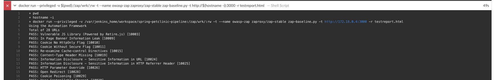

# OWASP ZAP Documentation
## SBOM
- **Host Machine.** Mac M1
- **OWASP ZAP.** zaproxy/zap-stable:latest
- **Docker.** docker.io latest

## Known Issues and Challenges
Several issues and challenges were encountered during the development of this phase in the pipeline which were primarily centred around hosting the Jenkins service on a Docker container vice a seperate VM / server. It is likely that had the Jenkins service been hosted on a VM seperately these issues would not have been faced.

Identified issues / challenges are as follows:
- **Resource Constraints.** During the initial startup of the Jenkins container and first run-through of the pipeline, a significant amount of disk space and computation resources were used to create the Jenkins container and subsequent OWASP ZAP container. 

    At least on one occurrence, a complete system prune and reconfiguration of allocated resources to Docker was required to ensure a successful deployment.
- **Docker-in-Docker Configuration.** Docker was the selected host of the Jenkins service at the beginning of the project for its shareability between developers to work on a common source. This design choice actually impacted the deployment of the OWASP container as typical deployments require a container to run scripts in via its command line rather than as a seperate server (e.g. sonarqube, prometheus / grafana). 

    This ultimately required having Docker be installed on the Jenkins container which contributed to resource constraints noted above and the entrypoint for automation. Having a Docker-in-Docker configuration is atypical and not best practice however still worked (albeit more difficult) in the context of the project.

- **Jenkins Plug-In's.** At a glance, Jenkins appears to have several integrations into Docker via the available plug-ins. Upon further investigation, these plug-ins were either deprecated, or only provided wrappers to Docker commands which were relatively unhelpful in the deployment of the OWASP container.

- **Petclinic Pre-Deployment and Exposed Ports.** Another challenge faced required that the petclinic app be deployed for OWASP ZAP to conduct the required scans. At a glance, OWASP ZAP scrapes the HTML of a chosen website and tests all of the potential endpoints as well as conduct some basic scans against documented vulenrabilities. 

    This challenge was relatively simple to address as the Spring Petclinic repo had already provided a means of deploying the web app locally. The added burden was knowing which IP and port to parse the OWASP ZAP command which will be covered below.

- **Handling Expected Failures from ZAP.** The Jenkins pipeline is extremely sensitive to failures. This combined with OWASP ZAPs expected response to fail when issues or warnings are documented created a blocker for the remaining of the pipeline. To circumvent this, the Docker run command for OWASP ZAP command was wrapped in a try-catch statement to ensure that the pipeline would not fail. Given more detail, certain failures may be accepted / rejected.


## Required Configuration / Files
The purpose of this section is to highlight specific sections within configuration files which are relevant to the deployment of OWASP ZAP. This section does not cover the general configuration of the containers or pipeline and the full explanation of these can be found in the parent README.

### Dockerfile (./jenkins_ci/Dockerfile)
**Notes:** 
- **Docker Install:** `apt-get install -y docker.io` is required to install docker as part of the Jenkins container, enabling it to deploy the OWASP ZAP container.
- **Entrypoint:** To enable automation, Docker is needed to run on startup so the Jenkinsfile script can run the OWASP ZAP container. The entrypoint.sh script (detailed below) ensures that both Docker and Jenkins are run at the creation of the Dockerfile's container.
```
FROM jenkins/jenkins:lts

# Install Jenkins plugins and their dependencies
RUN jenkins-plugin-cli --plugins \
    git \
    blueocean \

...

# Install Docker inside Jenkins container
USER root
RUN apt-get update && \
    apt-get install -y docker.io && \

...

# Override entrypoint to run both Docker service and Jenkins
COPY entrypoint.sh /usr/local/bin/entrypoint.sh
RUN chmod +x /usr/local/bin/entrypoint.sh

ENTRYPOINT ["/usr/local/bin/entrypoint.sh"]
```

### Docker Compose (./docker-compose.yml)
**Notes:**
- **Exposing Port:** The OWASP ZAP container built inside of the Jenkins container requires an exposed port to communicate with the rest of the container. In this case, the chosen port was 8090.
- **Privileged Status:** To run the required Docker commands inside of the Jenkins container, the Docker container is required to run in privileged mode (`privileged: true`).
```
version: '3.8'

services:
  jenkins:
    build: ./jenkins_ci
    container_name: jenkins
    privileged: true
    ports:
      - "8080:8080"
      - "50000:50000"
      - "8090:8090"
    volumes:
      - ./jenkins_home:/var/jenkins_home
    restart: always
    networks:
      - devops

...

networks:
  devops:
```

### Entrypoint.sh (./jenkins_ci/entrypoint.sh)
**Notes:**
- The purpose of this entrypoint script is to start the Docker and Jenkins services within the Jenkins container.
```
#!/bin/bash

# Start Docker service
service docker start

# Start Jenkins
exec /usr/local/bin/jenkins.sh "$@"

```
### Jenkinsfile (spring-petclinic-devops-group3:main ./Jenkinsfile)

**Notes:** 
- **Clean.** The purpose of the clean step is to remove previously created files from the OWASP ZAP step. An issue had been identified during the Maven build of the petclinic app which conducted a check-style scan on the below files and had thrown issues. These issues were unrelated to the actual deployment of the app and this was used as the workaround.

- **Build.** Occasionally, during the building of the web app, tests had failed while it was attempting to access a PostgreSQL service. For the purposes of this project the `-DskipTests` flag was used to skip these erronious failures and complete the build. 

- **Run.** The running of the OWASP ZAP step begins by deploying the web app locally. The script then pulls the latest OWASP ZAP image to deploy on a container (this occasionally took up to at least 5 minutes to complete a pull). The container was then run and the basic script was used to test the web apps local deployment. 

    Finally, the OWASP ZAP report was copied to the Jenkins workspace, and the container and web apps are removed.

- **Post.** After a successful run of the OWASP ZAP stage, the HTML report is published (using the HTML Publisher plug-in) to the Blue Ocean artifacts tab for viewing.


```
pipeline {
    agent any 

    stages {
        stage('Clean') {
            steps {
                script {
                    try {
                        sh 'rm testreport.html'
                    } catch (Exception e) {
                        echo 'no test here'
                    }
                    try {
                        sh 'rm zap.yaml'
                    } catch (Exception e) {
                        echo 'no yml here'
                    }
                }
            }
        }

        stage('Build') {
            steps {
                sh './mvnw clean package -DskipTests'
            }
        }

        ...
        
        stage('Run OWASP ZAP') {
            steps {
                script {
                    try {
                        sh 'java -jar target/*.jar & echo $! > java_pid.txt &'
    
                        sleep 30
                        
                        // Pull the OWASP ZAP Docker image
                        sh 'docker pull zaproxy/zap-stable'

                        try {
                        // Run OWASP ZAP Docker container
                        sh 'docker run --privileged -v $(pwd):/zap/wrk/:rw -t --name owasp-zap zaproxy/zap-stable zap-baseline.py -t http://$(hostname -i):3000 -r testreport.html'
                            
                        } catch (Exception e) {
                            echo 'Ignore error during ZAP script.'
                            sh 'pwd'
                            sh 'ls'
                        }

                        sh 'docker cp owasp-zap:/zap/wrk/testreport.html ${WORKSPACE}/testreport.html'
                        
                    } finally {
                        
                        // Kill the Java process
                        sh 'kill $(cat java_pid.txt) || true'

                        // Clean up containers
                        sh 'docker stop owasp-zap || true'
                        sh 'docker rm owasp-zap || true'
                    }
                }
            }
        }

        ...

    post {
        always {
            script {
                // Publish the HTML report
                publishHTML(target: [
                    allowMissing: false,
                    alwaysLinkToLastBuild: true,
                    keepAll: true,
                    reportDir: '',
                    reportFiles: 'testreport.html',
                    reportName: 'OWASP ZAP Report',
                    reportTitles: 'OWASP ZAP Security Test Report'
                ])
            }
        }
    }
}
```
## OWASP ZAP Step-by-Step Instructions:
1. **Initial Clean.** Each time the Maven builds the petclinic package, it conducts a check-style test on all files in the workspace. This scan would also include the files created by previous OWASP ZAP instances (zap.yml and testreport.html). Therefore, there was a requirement to ensure both files were removed from the directory. 

    In an instance where it was a fresh run (no prior instances of ZAP), the statement were wrapped in a try-catch call to ensure the build could still succeed. 
    
2. **Build .jar File.** Build the .jar file using the `.mvnw clean package -Dskiptests` command. The purpose of `-Dskiptests` command was to avoid occasional test fails that were as a result of the Spring Petclinic repo where in some cases the tests would try and access a Postgresql instance that did not exist. For the purposes of this project, they were skipped entirely. 


3. **Deploy Petclinic App.** Deploy the spring petclinic app locally on port 3000. The port allocation is handled in the Spring Petclinic in the application properties - if this was not modified, th default port would be 8080 and therefore conflict with the Jenkins container port. 

    This step also requires the process ID of the deployment to ensure it can be cleaned up at the end of the build.

4. **Pull ZAP Image.** The OWASP ZAP step requires the zaproxy/zap-stable:latest image to run the required OWASP ZAP tests. In this case, the pipeline had already been run and therefore the image completely downloaded however on a fresh build, this step would take ~3-5 mins.

    
5. **Run ZAP Image (Targetting Local Deployment).** Run the command, `docker run --privileged -v $(pwd):/zap/wrk/:rw -t --name owasp-zap zaproxy/zap-stable zap-baseline.py -t http://$(hostname -i):3000 -r testreport.html` to run the containers tests to target the local petclinic app deployment. 

    An explanation of the flags is as follows:
    - `-v $(pwd):/zap/wrk/:rw`: This creates a volume on the Jnekins container for the OWASP container to store the generated reports.
    - `zap-baseline.py`: This is the script to be run on the ZAP container and remaining flags are in relation to the .py script.
    - `-t http://$(hostname -i):3000`: Defines the target, 't', as the localhost's IP with the target port. 'hostname -i' is used as the ZAP command does not work with the default 'localhost:'.
    - `-r testreport.html`: Creates a report.

    The OWASP ZAP script is built to fail anytime that issues, warnings, or failures are detected in the codebase. As a way of handling these and for the purposes of the assignment, the above docker run command was wrapped in a try-catch statement in the Jenkinsfile script.

    

6. **Copy HTML Report and Clean.** Copy the html report to the jenkins workspace so that it may be published at the end of the pipeline and viewed. Subsequently, stop and remove the OWASP container. Finally, kill the petclinic process .

    

8. **View HTML Report.** View the html report in Blue Ocean artifacts tab.


## OWASP ZAP Steps Log Dump

```
The recommended git tool is: NONE
No credentials specified
 > git rev-parse --resolve-git-dir /var/jenkins_home/workspace/spring-petclinic-pipeline/.git # timeout=10
Fetching changes from the remote Git repository
 > git config remote.origin.url https://github.com/bintangadinandra/spring-petclinic-devops-group3.git # timeout=10
Fetching upstream changes from https://github.com/bintangadinandra/spring-petclinic-devops-group3.git
 > git --version # timeout=10
 > git --version # 'git version 2.39.2'
 > git fetch --tags --force --progress -- https://github.com/bintangadinandra/spring-petclinic-devops-group3.git +refs/heads/*:refs/remotes/origin/* # timeout=10
 > git rev-parse refs/remotes/origin/main^{commit} # timeout=10
Checking out Revision af099e1e1c09b1c2260e5f89b391bd4a0592a106 (refs/remotes/origin/main)
 > git config core.sparsecheckout # timeout=10
 > git checkout -f af099e1e1c09b1c2260e5f89b391bd4a0592a106 # timeout=10
Commit message: "This message is a demonstration"
+ rm testreport.html
+ rm zap.yaml

...

+ ./mvnw clean package -DskipTests
[INFO] Scanning for projects...
[INFO] 
[INFO] ------------< org.springframework.samples:spring-petclinic >------------
[INFO] Building petclinic 3.3.0-SNAPSHOT
[INFO]   from pom.xml
[INFO] --------------------------------[ jar ]---------------------------------
[INFO] 
[INFO] --- clean:3.3.2:clean (default-clean) @ spring-petclinic ---
[INFO] Deleting /var/jenkins_home/workspace/spring-petclinic-pipeline/target
[INFO] 
[INFO] --- enforcer:3.4.1:enforce (enforce-java) @ spring-petclinic ---
[INFO] Rule 0: org.apache.maven.enforcer.rules.version.RequireJavaVersion passed
[INFO] 
[INFO] --- spring-javaformat:0.0.41:validate (default) @ spring-petclinic ---
[INFO] 
[INFO] --- checkstyle:3.3.1:check (nohttp-checkstyle-validation) @ spring-petclinic ---
[INFO] You have 0 Checkstyle violations.
[INFO] 
[INFO] --- jacoco:0.8.12:prepare-agent (default) @ spring-petclinic ---
[INFO] argLine set to -javaagent:/root/.m2/repository/org/jacoco/org.jacoco.agent/0.8.12/org.jacoco.agent-0.8.12-runtime.jar=destfile=/var/jenkins_home/workspace/spring-petclinic-pipeline/target/jacoco.exec
[INFO] 
[INFO] --- git-commit-id:8.0.2:revision (default) @ spring-petclinic ---
[INFO] dotGitDirectory '/var/jenkins_home/workspace/spring-petclinic-pipeline/.git'
[INFO] Collected git.build.user.name with value 
[INFO] Collected git.build.user.email with value 
[INFO] Using environment variable based branch name. GIT_BRANCH = origin/main
[INFO] Collected git.branch with value origin/main
[INFO] Collected git.commit.id.describe with value af099e1
[INFO] Collected git.commit.id.describe-short with value af099e1
[INFO] Collected git.commit.id with value af099e1e1c09b1c2260e5f89b391bd4a0592a106
[INFO] Collected git.commit.id.abbrev with value af099e1
[INFO] Collected git.dirty with value false
[INFO] Collected git.commit.user.name with value daniel
[INFO] Collected git.commit.user.email with value danielhales8@gmail.com
[INFO] Collected git.commit.message.full with value This message is a demonstration
[INFO] Collected git.commit.message.short with value This message is a demonstration
[INFO] Collected git.commit.time with value 2024-07-25T14:00:53Z
[INFO] Collected git.commit.author.time with value 2024-07-25T14:00:53Z
[INFO] Collected git.commit.committer.time with value 2024-07-25T14:00:53Z
[INFO] Collected git.remote.origin.url with value https://github.com/bintangadinandra/spring-petclinic-devops-group3.git
[INFO] Collected git.tags with value 
[INFO] Collected git.tag with value 
[INFO] Collected git.closest.tag.name with value 
[INFO] Collected git.closest.tag.commit.count with value 
[INFO] Collected git.total.commit.count with value 997
[INFO] Collected git.local.branch.ahead with value NO_REMOTE
[INFO] Collected git.local.branch.behind with value NO_REMOTE
[INFO] Collected git.build.time with value 2023-05-10T07:42:50Z
[INFO] Collected git.build.version with value 3.3.0-SNAPSHOT
[INFO] Collected git.build.host with value 75b0142c7768
[INFO] Collected git.build.number with value 2
[INFO] including property 'git.tags' in results
[INFO] including property 'git.build.version' in results
[INFO] including property 'git.branch' in results
[INFO] including property 'git.build.host' in results
[INFO] including property 'git.build.number' in results
[INFO] including property 'git.commit.id' in results
[INFO] including property 'git.commit.user.email' in results
[INFO] including property 'git.local.branch.behind' in results
[INFO] including property 'git.commit.author.time' in results
[INFO] including property 'git.build.user.name' in results
[INFO] including property 'git.dirty' in results
[INFO] including property 'git.closest.tag.commit.count' in results
[INFO] including property 'git.commit.user.name' in results
[INFO] including property 'git.commit.id.abbrev' in results
[INFO] including property 'git.commit.id.describe-short' in results
[INFO] including property 'git.total.commit.count' in results
[INFO] including property 'git.commit.id.describe' in results
[INFO] including property 'git.build.user.email' in results
[INFO] including property 'git.commit.message.short' in results
[INFO] including property 'git.commit.committer.time' in results
[INFO] including property 'git.tag' in results
[INFO] including property 'git.closest.tag.name' in results
[INFO] including property 'git.local.branch.ahead' in results
[INFO] including property 'git.commit.time' in results
[INFO] including property 'git.build.time' in results
[INFO] including property 'git.commit.message.full' in results
[INFO] including property 'git.remote.origin.url' in results
[INFO] Writing properties file [/var/jenkins_home/workspace/spring-petclinic-pipeline/target/classes/git.properties] (for project petclinic)...
[INFO] 
[INFO] --- spring-boot:3.3.0:build-info (default) @ spring-petclinic ---
[INFO] 
[INFO] --- cyclonedx:2.8.0:makeAggregateBom (default) @ spring-petclinic ---
[INFO] CycloneDX: Resolving Dependencies
[INFO] CycloneDX: Creating BOM version 1.5 with 88 component(s)
[INFO] CycloneDX: Writing and validating BOM (JSON): /var/jenkins_home/workspace/spring-petclinic-pipeline/target/classes/META-INF/sbom/application.cdx.json
[INFO]            attaching as spring-petclinic-3.3.0-SNAPSHOT-cyclonedx.json
[INFO] 
[INFO] --- resources:3.3.1:resources (default-resources) @ spring-petclinic ---
[INFO] Copying 3 resources from src/main/resources to target/classes
[INFO] Copying 43 resources from src/main/resources to target/classes
[INFO] 
[INFO] --- compiler:3.13.0:compile (default-compile) @ spring-petclinic ---
[INFO] Recompiling the module because of changed source code.
[INFO] Compiling 24 source files with javac [debug parameters release 17] to target/classes
[INFO] 
[INFO] --- resources:3.3.1:testResources (default-testResources) @ spring-petclinic ---
[INFO] skip non existing resourceDirectory /var/jenkins_home/workspace/spring-petclinic-pipeline/src/test/resources
[INFO] 
[INFO] --- compiler:3.13.0:testCompile (default-testCompile) @ spring-petclinic ---
[INFO] Recompiling the module because of changed dependency.
[INFO] Compiling 15 source files with javac [debug parameters release 17] to target/test-classes
[INFO] 
[INFO] --- surefire:3.2.5:test (default-test) @ spring-petclinic ---
[WARNING]  Parameter 'systemProperties' is deprecated: Use systemPropertyVariables instead.
[INFO] Tests are skipped.
[INFO] 
[INFO] --- jacoco:0.8.12:report (report) @ spring-petclinic ---
[INFO] Skipping JaCoCo execution due to missing execution data file.
[INFO] 
[INFO] --- jar:3.4.1:jar (default-jar) @ spring-petclinic ---
[INFO] Building jar: /var/jenkins_home/workspace/spring-petclinic-pipeline/target/spring-petclinic-3.3.0-SNAPSHOT.jar
[INFO] 
[INFO] --- spring-boot:3.3.0:repackage (repackage) @ spring-petclinic ---
[INFO] Replacing main artifact /var/jenkins_home/workspace/spring-petclinic-pipeline/target/spring-petclinic-3.3.0-SNAPSHOT.jar with repackaged archive, adding nested dependencies in BOOT-INF/.
[INFO] The original artifact has been renamed to /var/jenkins_home/workspace/spring-petclinic-pipeline/target/spring-petclinic-3.3.0-SNAPSHOT.jar.original
[INFO] ------------------------------------------------------------------------
[INFO] BUILD SUCCESS
[INFO] ------------------------------------------------------------------------
[INFO] Total time:  9.206 s
[INFO] Finished at: 2024-07-25T14:02:19Z
[INFO] ------------------------------------------------------------------------

...

+ echo+ java 5973
 -jar target/spring-petclinic-3.3.0-SNAPSHOT.jar
Sleeping for 30 sec
+ docker pull zaproxy/zap-stable
Using default tag: latest
latest: Pulling from zaproxy/zap-stable
Digest: sha256:97b8efbc3556f4b3a39cbeb753ede2e2476dd35297bbcd1723a5198b4ba92bb4
Status: Image is up to date for zaproxy/zap-stable:latest
docker.io/zaproxy/zap-stable:latest
+ pwd
+ hostname -i
+ docker run --privileged -v /var/jenkins_home/workspace/spring-petclinic-pipeline:/zap/wrk/:rw -t --name owasp-zap zaproxy/zap-stable zap-baseline.py -t http://172.18.0.4:3000 -r testreport.html
Using the Automation Framework
Total of 28 URLs
PASS: Vulnerable JS Library (Powered by Retire.js) [10003]
PASS: In Page Banner Information Leak [10009]
PASS: Cookie No HttpOnly Flag [10010]
PASS: Cookie Without Secure Flag [10011]
PASS: Re-examine Cache-control Directives [10015]
PASS: Content-Type Header Missing [10019]
PASS: Information Disclosure - Sensitive Information in URL [10024]
PASS: Information Disclosure - Sensitive Information in HTTP Referrer Header [10025]
PASS: HTTP Parameter Override [10026]
PASS: Open Redirect [10028]
PASS: Cookie Poisoning [10029]
PASS: User Controllable Charset [10030]
PASS: Viewstate [10032]
PASS: Directory Browsing [10033]
PASS: Heartbleed OpenSSL Vulnerability (Indicative) [10034]
PASS: Strict-Transport-Security Header [10035]
PASS: HTTP Server Response Header [10036]
PASS: Server Leaks Information via "X-Powered-By" HTTP Response Header Field(s) [10037]
PASS: X-Backend-Server Header Information Leak [10039]
PASS: Secure Pages Include Mixed Content [10040]
PASS: HTTP to HTTPS Insecure Transition in Form Post [10041]
PASS: HTTPS to HTTP Insecure Transition in Form Post [10042]
PASS: User Controllable JavaScript Event (XSS) [10043]
PASS: Big Redirect Detected (Potential Sensitive Information Leak) [10044]
PASS: Retrieved from Cache [10050]
PASS: X-ChromeLogger-Data (XCOLD) Header Information Leak [10052]
PASS: Cookie without SameSite Attribute [10054]
PASS: CSP [10055]
PASS: X-Debug-Token Information Leak [10056]
PASS: Username Hash Found [10057]
PASS: X-AspNet-Version Response Header [10061]
PASS: PII Disclosure [10062]
PASS: Timestamp Disclosure [10096]
PASS: Hash Disclosure [10097]
PASS: Cross-Domain Misconfiguration [10098]
PASS: Source Code Disclosure [10099]
PASS: Weak Authentication Method [10105]
PASS: Reverse Tabnabbing [10108]
PASS: Modern Web Application [10109]
PASS: Dangerous JS Functions [10110]
PASS: Authentication Request Identified [10111]
PASS: Session Management Response Identified [10112]
PASS: Verification Request Identified [10113]
PASS: Script Served From Malicious Domain (polyfill) [10115]
PASS: Private IP Disclosure [2]
PASS: Session ID in URL Rewrite [3]
PASS: Script Passive Scan Rules [50001]
PASS: Stats Passive Scan Rule [50003]
PASS: Insecure JSF ViewState [90001]
PASS: Java Serialization Object [90002]
PASS: Insufficient Site Isolation Against Spectre Vulnerability [90004]
PASS: Charset Mismatch [90011]
PASS: WSDL File Detection [90030]
PASS: Loosely Scoped Cookie [90033]
WARN-NEW: Cross-Domain JavaScript Source File Inclusion [10017] x 16 
	http://172.18.0.4:3000 (200 OK)
	http://172.18.0.4:3000 (200 OK)
	http://172.18.0.4:3000/ (200 OK)
	http://172.18.0.4:3000/ (200 OK)
	http://172.18.0.4:3000/owners/find (200 OK)
WARN-NEW: Missing Anti-clickjacking Header [10020] x 9 
	http://172.18.0.4:3000 (200 OK)
	http://172.18.0.4:3000/ (200 OK)
	http://172.18.0.4:3000/owners/find (200 OK)
	http://172.18.0.4:3000/owners/new (200 OK)
	http://172.18.0.4:3000/owners?lastName=ZAP (200 OK)
WARN-NEW: X-Content-Type-Options Header Missing [10021] x 12 
	http://172.18.0.4:3000 (200 OK)
	http://172.18.0.4:3000/ (200 OK)
	http://172.18.0.4:3000/owners/find (200 OK)
	http://172.18.0.4:3000/owners/new (200 OK)
	http://172.18.0.4:3000/owners?lastName=ZAP (200 OK)
WARN-NEW: Information Disclosure - Debug Error Messages [10023] x 1 
	http://172.18.0.4:3000/oups (500 Internal Server Error)
WARN-NEW: Information Disclosure - Suspicious Comments [10027] x 1 
	http://172.18.0.4:3000/webjars/bootstrap/5.3.3/dist/js/bootstrap.bundle.min.js (200 OK)
WARN-NEW: User Controllable HTML Element Attribute (Potential XSS) [10031] x 7 
	http://172.18.0.4:3000/owners?lastName=ZAP (200 OK)
	http://172.18.0.4:3000/vets.html?page=1 (200 OK)
	http://172.18.0.4:3000/owners/new (200 OK)
	http://172.18.0.4:3000/owners/new (200 OK)
	http://172.18.0.4:3000/owners/new (200 OK)
WARN-NEW: Content Security Policy (CSP) Header Not Set [10038] x 9 
	http://172.18.0.4:3000 (200 OK)
	http://172.18.0.4:3000/ (200 OK)
	http://172.18.0.4:3000/owners/find (200 OK)
	http://172.18.0.4:3000/owners/new (200 OK)
	http://172.18.0.4:3000/owners?lastName=ZAP (200 OK)
WARN-NEW: Non-Storable Content [10049] x 11 
	http://172.18.0.4:3000/oups (500 Internal Server Error)
	http://172.18.0.4:3000 (200 OK)
	http://172.18.0.4:3000/ (200 OK)
	http://172.18.0.4:3000/owners/find (200 OK)
	http://172.18.0.4:3000/owners/new (200 OK)
WARN-NEW: Permissions Policy Header Not Set [10063] x 10 
	http://172.18.0.4:3000 (200 OK)
	http://172.18.0.4:3000/ (200 OK)
	http://172.18.0.4:3000/owners/find (200 OK)
	http://172.18.0.4:3000/owners/new (200 OK)
	http://172.18.0.4:3000/owners?lastName=ZAP (200 OK)
WARN-NEW: Absence of Anti-CSRF Tokens [10202] x 4 
	http://172.18.0.4:3000/owners/find (200 OK)
	http://172.18.0.4:3000/owners/new (200 OK)
	http://172.18.0.4:3000/owners?lastName=ZAP (200 OK)
	http://172.18.0.4:3000/owners/new (200 OK)
WARN-NEW: Sub Resource Integrity Attribute Missing [90003] x 12 
	http://172.18.0.4:3000 (200 OK)
	http://172.18.0.4:3000 (200 OK)
	http://172.18.0.4:3000/ (200 OK)
	http://172.18.0.4:3000/ (200 OK)
	http://172.18.0.4:3000/owners/find (200 OK)
WARN-NEW: Application Error Disclosure [90022] x 1 
	http://172.18.0.4:3000/oups (500 Internal Server Error)
FAIL-NEW: 0	FAIL-INPROG: 0	WARN-NEW: 12	WARN-INPROG: 0	INFO: 0	IGNORE: 0	PASS: 54
Ignore error during ZAP script.
+ pwd
/var/jenkins_home/workspace/spring-petclinic-pipeline
+ ls
Jenkinsfile
LICENSE.txt
build.gradle
deploy.yml
docker-compose.yml
dummy.txt
gradle
gradlew
gradlew.bat
inventory
java_pid.txt
mvnw
mvnw.cmd
pom.xml
readme.md
settings.gradle
src
target
testreport.html
zap.yaml
+ docker cp owasp-zap:/zap/wrk/testreport.html /var/jenkins_home/workspace/spring-petclinic-pipeline/testreport.html
+ cat java_pid.txt
+ kill 5973
+ docker stop owasp-zap
owasp-zap
+ docker rm owasp-zap
owasp-zap

```