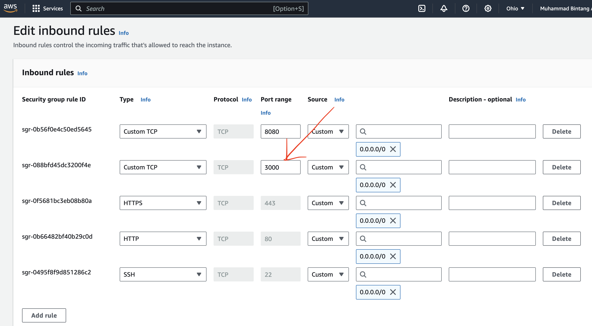

# Ansible Setup Steps
This section will define the setup in three main flow:
- Prequisite: Have your production VM ready (Amazon EC2)
- Set Up Ansible Jenkins
- Set Up Repo (spring-petclinic)

### Prequisite: Have your production VM ready (Amazon EC2)
1. Go to [AWS](https://aws.amazon.com/) portal and create an account
2. Login to your console and create launch EC2 instance  
3. Create an instance that has these specification to make sure that you're choosing the free tier:
    - Base Image: Ubuntu. Version 24++ should be okay
    - Instance Type: t2.micro 
4. When scrolling down to the **Key Pair** section, click **Create New Key Pair**. You can put the name whatever you like. Make sure it's recognizable so that you can locate it. 
5. Launch the instance, and wait for a while.
6. Since our app will run on port 3000, we have to update the security group to update the inbound to accept port 3000. Locate to the security group settings, and click the one that you've created (normally it's not the default).
7. Add Port 3000 as follows and click add rule. 

At the end of this AWS setup make sure you have **The Key Pair** that you created. You can download the keypair from the AWS console.

### Setup Ansible in Jenkins
1. Create a docker file that extends the Jenkins base image. The image will have to have ansible installed. To do so, make sure you add these two lines:
    - Adding plugins (this could also be done from jenkis dashboard)
        ```
        RUN jenkins-plugin-cli --plugins \
            # .. Your other plugins
            ansible
        ```
    - Adding ansible cli (This has to be done THROUGH HERE)
        ```
        RUN apt-get update && \
            # .. Your other installs
            apt-get install -y ansible && \
        ```
    More or less, the file will be like this. You could also locate from `jenkins_ci/Dockerfile` for example. 
2. Rebuild and rerun the image into container
3. Check whether ansible is correctly installed by execute it to the container using `docker exec -it <your_jenkins_container_name> bash` and run `ansible playbook --version`. 
4. Open your jenkins portal (normally it should http://localhost:8080). Login as an admin (see jenkins readme for detail).
5. Locate to the add credentials form. The flow starts once you're in the dashboard.
    - Click **Manage Jenkins**
    - Click **Credentials**
    - Click the **(global)** text, you can choose one of it if there are more
    - Click the **+Add Credentials**
6. Fill the form. Make sure to:
    - Kind: `SSH Username with private key`
    - Scope: `Global`
    - Id: `ec2-key` <<< THIS IS **IMPORTANT**
    - Username: `ubuntu`
    - Private Key: enter directly. Paste the `.pem` file **content** that you've received when you set up the server.
7. Double check to be more or less similar with the screenshot 
8. Click **Create**

And you're done. Congratulations.

### Setup Ansible in Your Source Code
1. Create a new file called `inventory` in the root of your source code. Add these two liner in the file:
    ```
    [web]
    ec2-....us-east-2.compute.amazon.aws ## This should be your ec2 public dns that you launch
    ```
2. Create a new file called `deploy.yml` in the root of your source code. Add these lines of code:
    ```
    ---
    - hosts: web
    become: yes
    vars:
        ansible_ssh_common_args: '-o StrictHostKeyChecking=no'
    tasks:
        - name: Install Java
        apt:
            name: openjdk-17-jdk
            state: present
            update_cache: yes

        - name: Copy application jar to EC2
        copy:
            src: target/spring-petclinic-3.3.0-SNAPSHOT.jar
            dest: /home/ubuntu/spring-petclinic-3.3.0-SNAPSHOT.jar

        - name: Copy systemd service file
        copy:
            content: |
            [Unit]
            Description=Spring Boot Application
            After=network.target

            [Service]
            User=ubuntu
            ExecStart=java -jar /home/ubuntu/spring-petclinic-3.3.0-SNAPSHOT.jar
            Restart=always
            RestartSec=10

            [Install]
            WantedBy=multi-user.target
            dest: /etc/systemd/system/spring-petclinic.service

        - name: Start and enable the service
        systemd:
            name: spring-petclinic
            enabled: yes
            state: restarted
    ```
    This tells ansible to do 3 things in the ec2 server when it's going to deploy the new build.
    - Reinstall java, and use openjdk-17-jdk explicitly
    - Copy application jar (build result) to the instance, which was build during the pipeline
    - Create the systemmd service file. This creates the behavior of the app to be a service, do that you don't have to worry about terminal window
    - Restart the service.
3. Update the `Jenkinsfile` to add this new steps. Which to deploy the code to EC2
```
    stage('Clean')...
    stage('Build')...
    stage('SonarQube Analysis')...
    stage('Run OWASP Zap')...

    # Add this one
    stage('Deploy to EC2') {
        steps {
            ansiblePlaybook(
                playbook: 'deploy.yml',
                inventory: 'inventory',
                credentialsId: 'ec2-key' # This is why the id must be match with the last step in Jenkins!
            )
        }
    }
```

### Conclusion
We add new step called `Deploy to EC2` in Jenkins. This step must read the deploy.yml and inventory file to check the steps of the deployment and dns. The credentials that is used called `ec2-key` is the one that we created in the Jenkins dashboard which was from the Amazon EC2 key pair that we generate at the beginning. This enables Jenkins build to ssh to the server and ansible will do all the substep of the deployment (reinstall java, copy jar file, register service, and restart the service).

### Example Run
When a new commit is made to the main branch, it will trigger a jenkins build. The entire workflow would be like this:

The logs shows the steps that is defined on the `deploy.yml` file in the main repo.

In one of our videos, we made a commit that change the welcome text. Within seconds after the job is done (15-20 seconds), when we refresh the browser the changes will reflect as follows:
