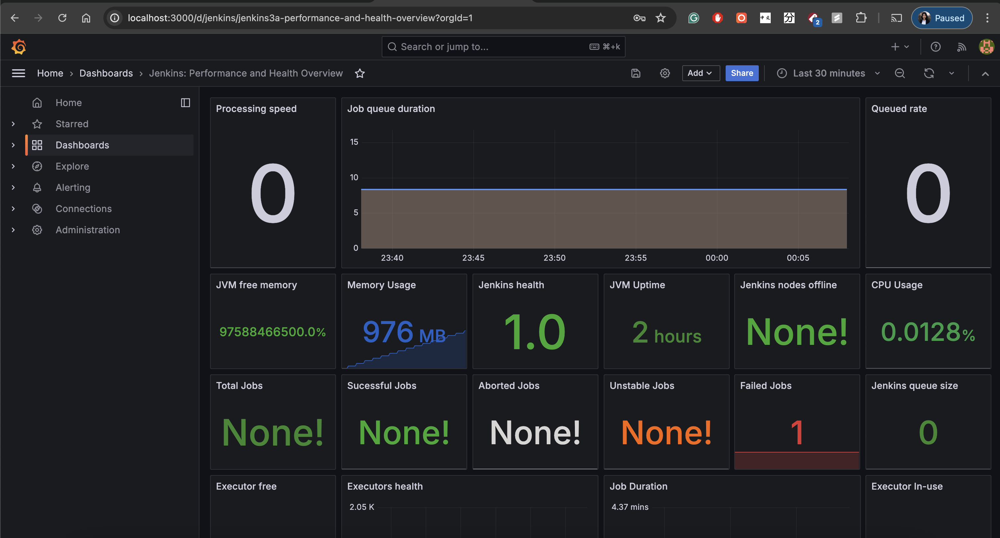

# Grafana:
## Step-by-Step Instructions:
0. Like other services, do `docker compose up -d`.We use the image `grafana/grafana` and set up grafana service along with others using docker compose, as following:

```
  grafana:
    image: grafana/grafana
    container_name: grafana
    ports:
      - 3000:3000
    restart: always
    environment:
      - GF_SECURITY_ADMIN_USER=admin
      - GF_SECURITY_ADMIN_PASSWORD=admin
    volumes:
      - ./grafana/provisioning/:/etc/grafana/provisioning/
    networks:
      - devops
```
1. Go to `http://localhost:3000/login`

2. Input Grafana credentials:
  - user: admin
  - password: admin
3. Check out the dashboard: http://localhost:3000/d/jenkins/jenkins3a-performance-and-health-overview?orgId=1


## Dashboard link reference:
Dashboard link: http://localhost:3000/d/jenkins/jenkins3a-performance-and-health-overview?orgId=1
Dashboard file reference: https://grafana.com/grafana/dashboards/9964-jenkins-performance-and-health-overview/
