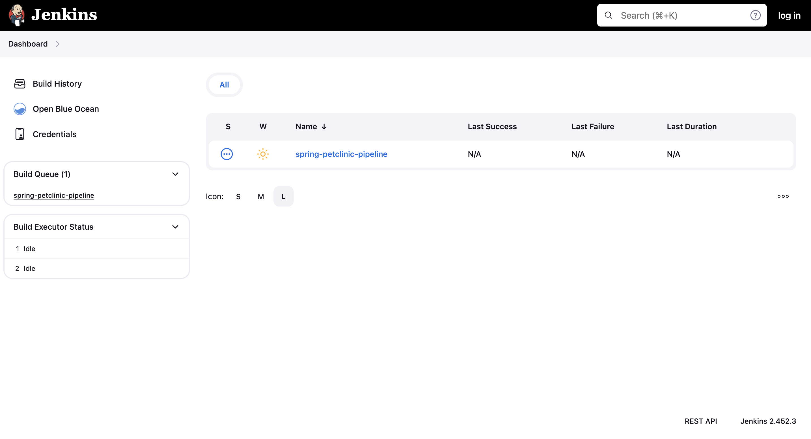
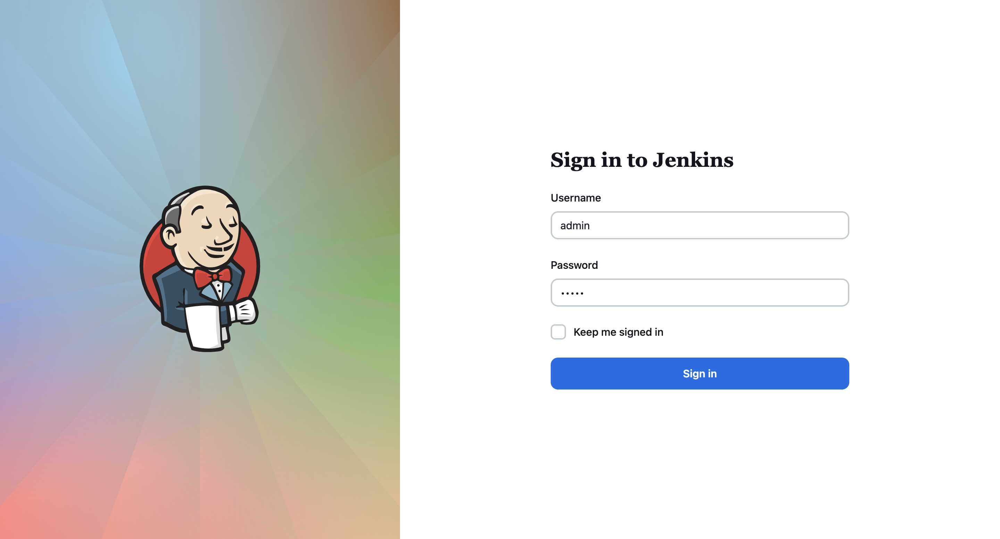

# Jenkins Setup Steps
In this project, we would recommend to spin up Jenkins using the provided Dockerfile under `/jenkins_ci/Dockerfile`.
The steps are:
1. Build the jenkins image
```
$ cd jenkins_ci
$ docker build -t jenkins-devops
```
2. Then spin it up using:
```
$ docker run -p 8080:8080 -p 50000:50000 --restart=on-failure -v jenkins_home:/var/jenkins_home jenkins-devops
```
Note:
- This tells docker to forward the port 50000 and port 8080 from the docker container to the host
- You can change the volume to whatever you want. The volume is responsible to store the build process
3. Open jenkins on localhost:8080 and you should see this screen:

4. Click the log in button on the top right to login
5. Enter `admin` as username and `admin` as password to log in



### Caveats
The [Dockerfile](jenkins_ci/Dockerfile) file. already included the [init.groovy](jenkins_ci/init.groovy.d/init.groovy) file. The file already set up several Jenkins administrative levels such as:
- Admin Account (username: `admin`, password: `admin`)
- The git SCM to our spring petclinic project and the scheduling (CRON)
- The pipeline for this project under the name of `spring-petclinic-pipeline`
- SSH Key
- Create one job.

#### SSH Key
In order to run the pipeline and be able to deploy to the EC2, please fill the [ec2.pem](jenkins_ci/init.groovy.d/ec2.pem) file with your AWS key that has access to the server. Refer to the [README-Ansible](README-ansible.md) file.

#### Docker Compose
In order to speeds up the project, we would also recommend to use the `docker-compose.yml` file to spin up everything. It already included the SonarQube, Prometheus, and Grafana for the completion of this project.
