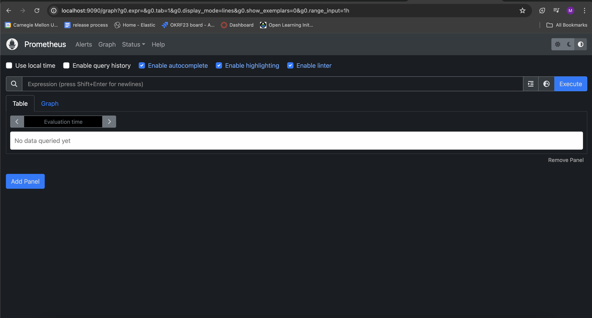
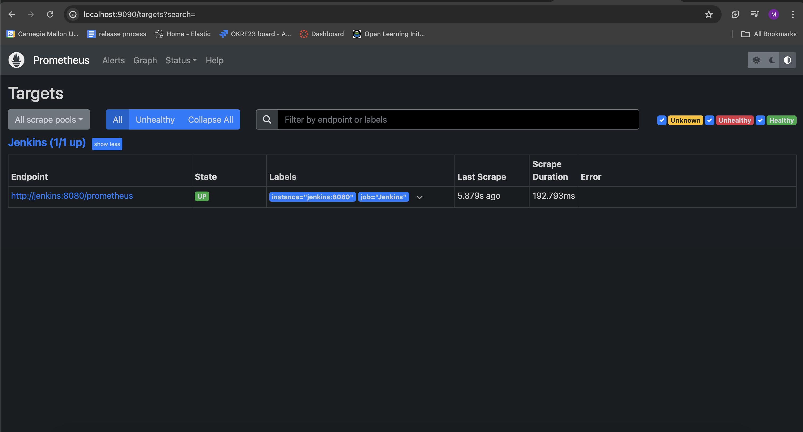

# Prometheus Monitoring for Jenkins
## Prometheus Installation:
Prometheus plugin in Jenkins is configured to be installed at `jenkins_ci/Dockerfile`. This allows Prometheus plugin to get installed in Jenkins container when it's fired up.

## Configuration:
Prometheus configuration is found in `prometheus/prometheus.yml`. It tells prometheus where Jenkins service is and how often to scrape metrics, using the `/prometheus` endpoint.

### Step-by-Step Instructions:
0. Do `docker-compose up -d`. We use the image `prom/prometheus` and set up Prometheus service along with others using `docker-compose`, as following:

```
  prometheus:
    image: prom/prometheus
    container_name: prometheus
    command:
      - '--config.file=/etc/prometheus/prometheus.yml'
    ports:
      - 9090:9090
    restart: always
    volumes:
      - ./prometheus:/etc/prometheus
    networks:
      - devops
```
1. Access Prometheus UI by navigating to `http://localhost:9090` in your web browser: 

2. Choose `Status`, then `Targets` to check out the target tab for if and how often prometheus is scraping jenkins:
