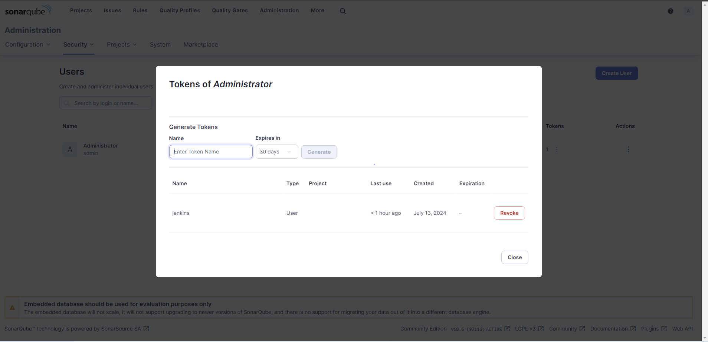
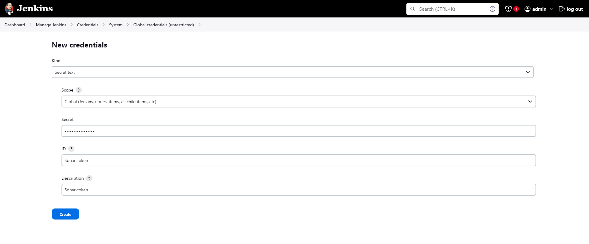
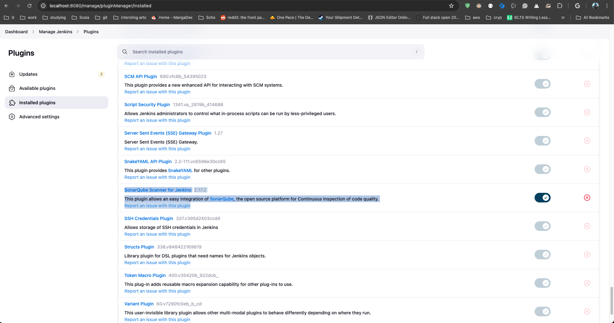
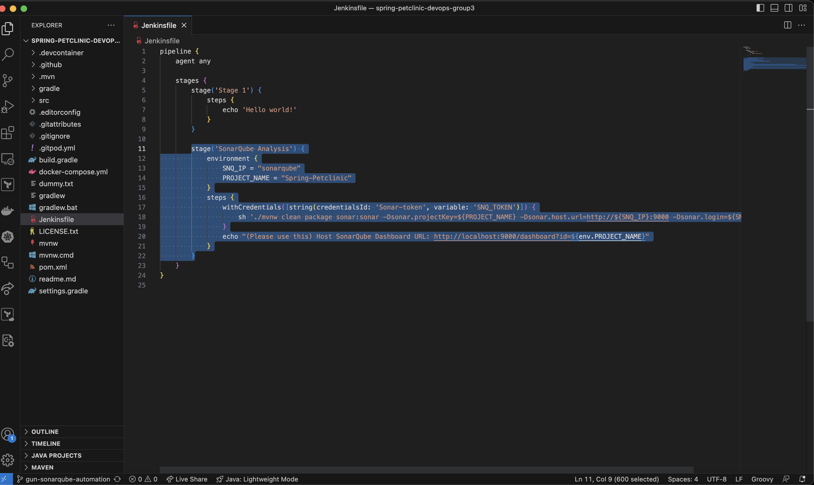
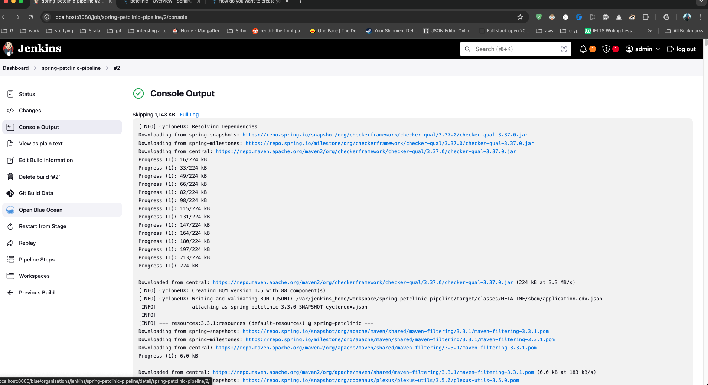
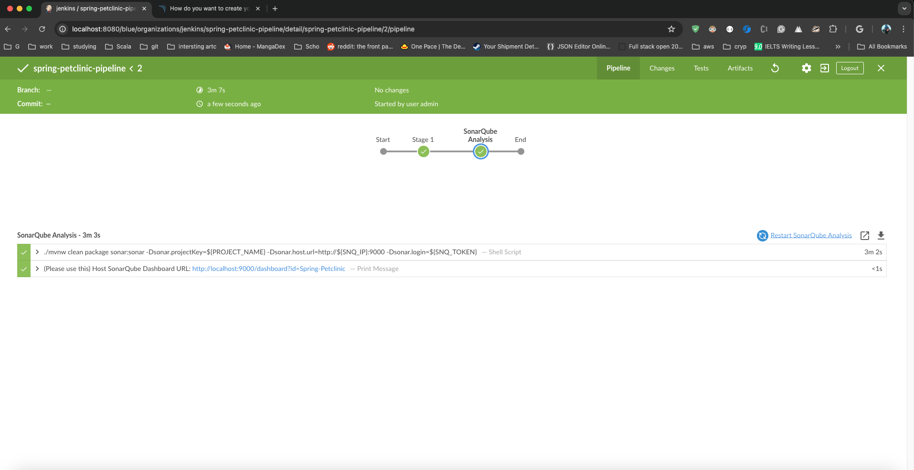
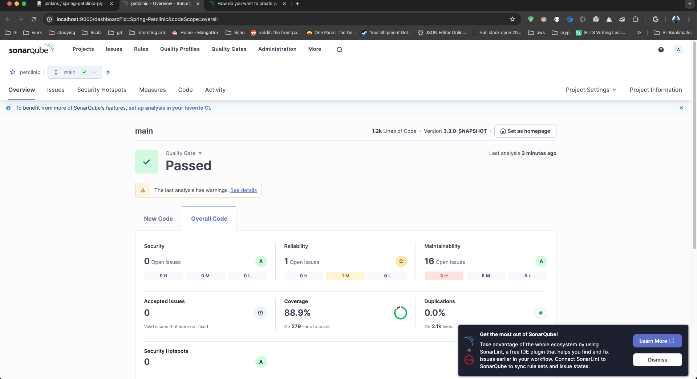

# Sonarqube Step-by-Step Instructions:
1. Run sonarqube using `sonarqube:community` docker image with the same network as Jenkins. 
   1. In this project we use docker-compose so we add this to the compose file using the saem `devops` network
   ```
      sonarqube:
        image: sonarqube:community
        volumes:
        - sonarqube_data:/opt/sonarqube/data
        - sonarqube_extensions:/opt/sonarqube/extensions
        - sonarqube_logs:/opt/sonarqube/logs
        ports:
        - "9000:9000"
        restart: always
        networks:
        - devops
   ```
2. Access SonarQube UI by navigating to `http://localhost:9000` in your web browser
3. Generate SonarQube Token
   1. Log in to SonarQube using the admin credentials.
   2. Navigate to "Administration" -> "Security" -> "Users"
   3. Click on Tokens hamburger menu of admin account 
   4. Generate token  
   5. Copy the token to be put in jenkins
4. Put Sonarqube token in Jenkins
   1. Go to Jenkins dashboard
   2. Goto Dashboard -> Manage Jenkins -> Credentials
   3. Click on `(global)` domain 
   4. Add Secret Text, named in `Sonar-token` and put the copied token in value 
   5. click create
5. Install Sonar plugin in jenkins
   1. In this project, we install the plugin directly in custom Jenkins docker image
   2. But we can also download Sonar plugin from Jenkins plugin download page as well
   
6.  (Optional) Edit your `/etc/hosts` file to add `127.0.0.1 sonarqube` this is for making the report appear on jenkins seemslessly
7.  Add new pipeline step for running sonarqube in `sring-petclinic` project
    1.  Add `SCANNER_HOME=tool 'sonar-scanner'` to the environment (the `sonar-scanner` tool that we set up)
    2.  Add the below step to run sonar scanner that will call out `sonarqube` server to run the code analysis tool and report
        ```
        stage('SonarQube Analysis') {
            environment {
                SNQ_IP = "sonarqube"
                PROJECT_NAME = "Spring-Petclinic"
            }
            steps {
                withCredentials([string(credentialsId: 'Sonar-token', variable: 'SNQ_TOKEN')]) {
                    sh './mvnw clean package sonar:sonar -Dsonar.projectKey=${PROJECT_NAME} -Dsonar.host.url=http://${SNQ_IP}:9000 -Dsonar.login=${SNQ_TOKEN}'
                }
                echo "(Please use this) Host SonarQube Dashboard URL: http://localhost:9000/dashboard?id=${env.PROJECT_NAME}"
            }
        }
        ```
    3.  Example here https://github.com/bintangadinandra/spring-petclinic-devops-group3/pull/1/files
    4. 
10. Push added pipeline step to `spring-petclinic` repo
11. Wait for pipeline to run
12. See the report in Jenkins 
    1. Open Blue Ocean plugin page
    2. Go to the Sonarqube stage in the pipeline
    3. Scroll down to the bottom
    4. You will see the link to the dashboard *(Use localhost url for ease of use)*
    
    
    5.  or in sonarqube tab (note that the Sonarqube url is using `sonarqube:9000` which is what we set in the step #7 to make it work seemlessly on local machine ) _sonar_with_hosts_modified.png)
